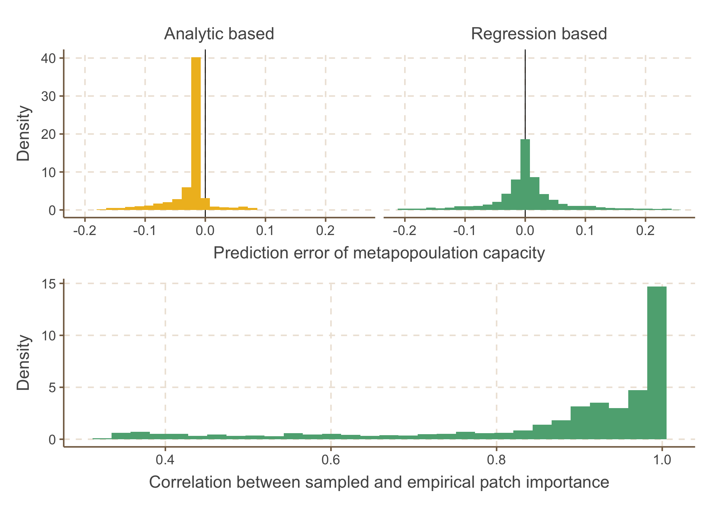

<!-- README.md is generated from README.Rmd. Please edit that file -->

# ReproduceMetaCap

<!-- badges: start -->
<!-- badges: end -->

The goal of this package is to reproduce the paper “Metapopulation
persistence can be inferred from incomplete surveys” by Chuliang Song,
Marie-Josée Fortin, and Andrew Gonzalez.

## Installation

You can install the development version of ReproduceMetaCap from
[GitHub](https://github.com/) with:

``` r
# install.packages("devtools")
devtools::install_github("clsong/ReproduceMetaCap")
```

## Reproduce

The main figures can be reproduced simply by running
*plot_figure_Number*. For example, figure 3 can be reproduced as

``` r
library(ReproduceMetaCap)
plot_figure_3()
```


